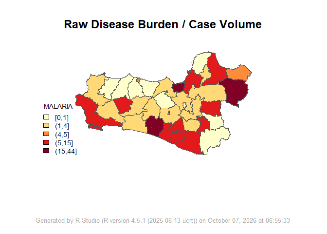
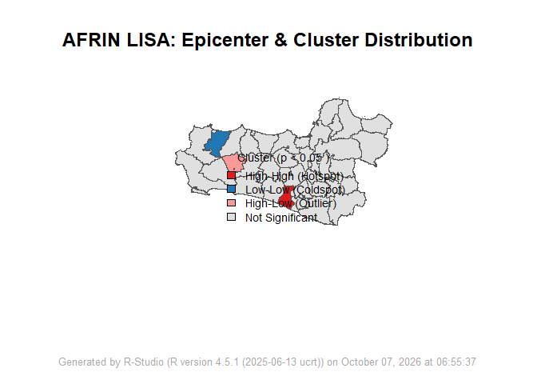
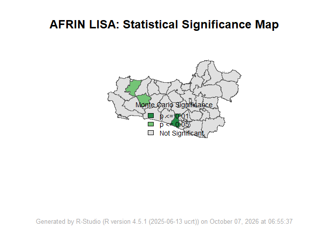
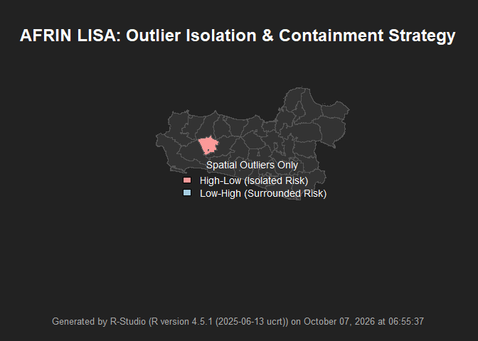
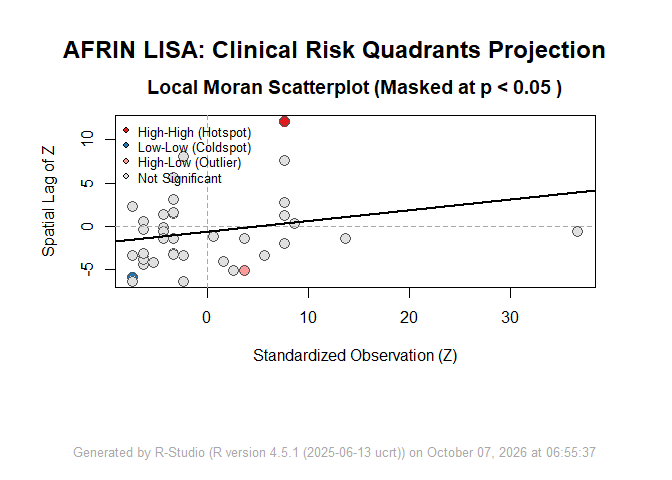

<!-- README.md is generated from README.Rmd. Please edit that file -->

# AFRIN 🌍🗺️

AFRIN (Applied Functions for R-based Intelligence and Nodes) is a
geospatial analytics framework specifically designed for modern
Geospatial Medicine, Spatial Epidemiology, and Healthcare Network
Analysis (Business Process Reengineering). Bypassing heavy third-party
spatial dependencies, AFRIN utilizes mathematically rigorous Base R
algorithms integrated seamlessly with core spatial engines (sf). It
automatically outputs publication-ready, 4K diagnostic spatial profiles
suitable for top-tier medical and public health journals.

<figure>

<figcaption aria-hidden="true">A5_Teams</figcaption>
</figure>

# ✨ Key Features:

- Zero-Dependency Core Computations: Performs complex spatial matrix
  algebra (e.g., Global/Local Moran’s I, Spatial Regression MLE,
  Regionalization) purely in Base R, ensuring extreme stability and
  preventing CRAN deprecation crashes.
- 4-Panel 4K Diagnostic Profiling: Every function automatically
  generates four high-resolution (4K) thematic and analytical plots,
  providing a complete 360-degree view of the spatial data (Base Maps,
  Statistical Distributions, Tactical Isolation Maps, and Significance
  Profiling).
- Intelligent Auto-Coercion & Clinical Topology Flags: Automatically
  rescues corrupt character data formats commonly found in government
  Shapefiles/DBFs, and flags topological errors (overlapping
  polygons/holes) before modeling begins.
- Strict Clinical Boundary Checks: Masks non-significant spatial
  clusters (p \> 0.05) or regression coefficients whose Confidence
  Intervals cross the null boundary, preventing false-alarm
  interventions and budget misallocation.

# 👥 Authors / Contributors

- **Muhammad Almanfaluthi** - *Creator & Lead Developer* -
  [Almanfaluthi](https://github.com/Almanfaluthi) - Department of
  Tropical Medicine and Parasitology, Faculty of Medicine, Universitas
  Muhammadiyah Purwokerto, Central Java, Indonesia
- **Khusnul Fathoni Effendy** - *Methodology & Co-Author* - Faculty of
  Medicine, Brawijaya University, East Java, Indonesia
- **Satini Yuniarsih** - *Methodology & Co-Author* - Muslim Kaffah
  Foundation, East Java, Indonesia
- **Stefani Widodo** - *Methodology & Co-Author* - Department of Public
  Health, Faculty of Medicine, Universitas Muhammadiyah Purwokerto,
  Central Java, Indonesia
- **Zuhrotun Ulya** - *Methodology & Co-Author* - Faculty of Medicine,
  Brawijaya University, East Java, Indonesia
- **Shalahuddin Maulidi** - *Methodology & Co-Author* - Lembaga
  Kesehatan Gigi dan Mulut Pusat Kesehatan TNI Angkatan Darat
  (Indonesian Army)
- **Rara Tarika** - *Methodology & Co-Author* - Lembaga Kesehatan Gigi
  dan Mulut Pusat Kesehatan TNI Angkatan Darat (Indonesian Army)
- **Abidah Safitri** - *Methodology & Co-Author* - Muslim Kaffah
  Foundation, East Java, Indonesia

# 🚀 Installation

You can install the development version of AFKAR like so:

1.  install [R](https://www.r-project.org/)

2.  install [R-studio](https://posit.co/downloads)

3.  install [Rtools](https://cran.r-project.org/bin/windows/Rtools/)
    \#windows

4.  install.packages(“devtools”) \#paste in your console (lower left)

5.  devtools::install_github(“Almanfaluthi/AFRIN”) \#paste in your
    console (lower left)

# 🛠️ Architecture & Modules (Spatial Foundation & Mapping)

- A1_loadspatial(): Universal Spatial Data Loader & 4-Stage Profiler
  (Geometry, Toplogy, Extent, Attribute).
- A2_mapping(): Epidemiological Choropleth & Empirical Bayes Smoothing
  (Addresses Small Area Estimation Bias).

# 🛠️ Architecture & Modules (Spatial Autocorrelation & Nodes)

- B1_GlobalAutocorrelationMoranI(): Global Spatial Autocorrelation &
  Network Validation.
- B2_LocalIndicatorSpatialAssociation(): LISA Epicenter Detection &
  Outlier Isolation (Hotspot/Coldspot).
- B3_SpatialBufferDistanceDecay(): Healthcare Blank Spot Finder & Golden
  Hour Evaluator.
- B4_IntelligenceNodeFinder(): Syndemic Node Suitability & Hub-and-Spoke
  Network Allocator.

# 🛠️ Architecture & Modules (Explanatory Spatial Models & Space-Time)

- C1_SpatialRegression(): Spatial Lag Model (MLE) & Spillover Impact
  Profiler.
- C2_SpaceTimeHotSpot(): Spatiotemporal Propagation, Center of Gravity
  Trajectory, and Hovmöller Diagrams.
- C3_Regionalization(): Spatially Constrained Syndemic Zoning (Modified
  Adjacency Penalty & hclust).

📖 Example This is a basic example which shows you how to deploy AFRIN’s
Geospatial Medicine modules:

``` r
library(AFRIN)
# A2: Empirical Bayes Smoothed Mapping
# Corrects extreme incidence rate variance in small rural populations
A2_mapping(spatial_data = df_jateng, cases_col = "MALARIA", pop_col = "AREA", smoothing = FALSE)
#> Warning: AFRIN Warning: 'cases_col' ( MALARIA ) is not numeric. Auto-coercing
#> to numeric...
```



    #> AFRIN Note: Mapping complete. Variables auto-coerced (if needed) and appended successfully.
    # B2: Local Indicator of Spatial Association (LISA)
    # Precisely pinpoints Malaria epicenters (Hotspots) and vulnerable outliers for targeted fogging
    B2_LocalIndicatorSpatialAssociation(spatial_data = df_jateng, var_col = "MALARIA")
    #> Warning: AFRIN Warning: 'var_col' ( MALARIA ) is not numeric. Auto-coercing...
    #> AFRIN Note: Building Spatial Weights Matrix & Computing LISA...
    #> AFRIN Note: Running 999 Local Monte Carlo permutations...



    #> AFRIN Note: Local Indicator of Spatial Association completed.

🤝 Contributing Contributions, issues, and feature requests are welcome!
Feel free to check the issues page. If you are using AFRIN for your
epidemiological surveillance, clinical trials, or hospital logistics,
we’d love to hear your feedback.

📝 License This project is licensed under the MIT License - see the
LICENSE.md file for details.
